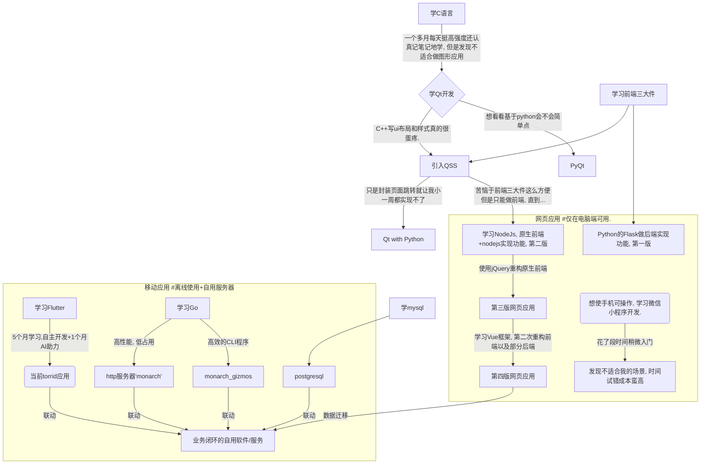
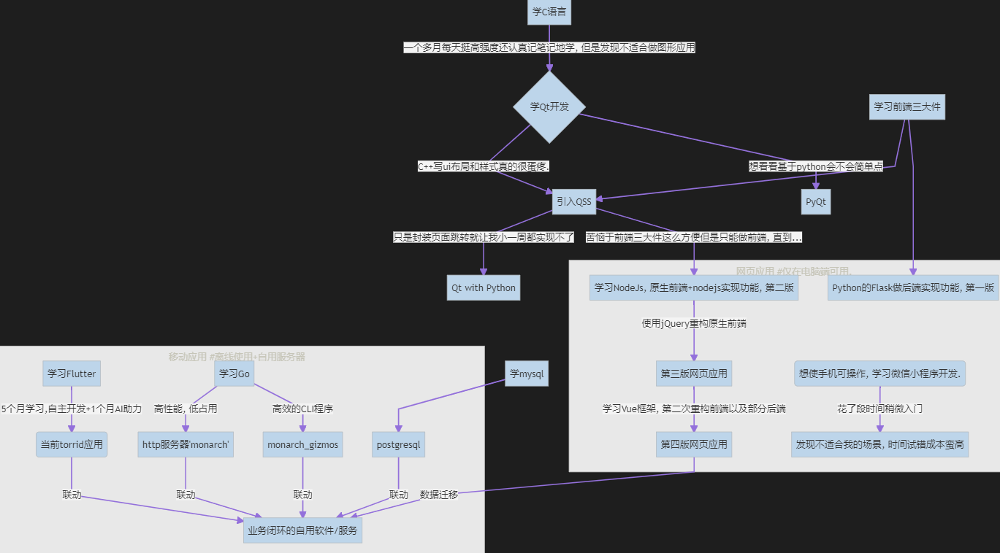

+++
date = '2026-02-15T21:51:25+08:00'
draft = true
title = '个性软件torrid总结'


categories=['编程', '软件开发', '全栈', '数据库', 'AI']

tags=['Flutter', '客户端', 'agentic coding', 'Go', '服务端', 'CLI命令行程序']

+++

# 项目文档展示

## TORRID

> 

## MONARCH

> 

## MONARCH_GIZMOS

> 

# 重要AI prompt展示

## 展示理由以及说明

> 自从25年12月得到github copilot教育福利的每月免费额度后, 渐渐地越来越依赖这个开发, 尤其是之后的claude opus 4.5, 强的离谱, 效果好的离谱.
>
> 下面给出一些我开发时经常附上的追加要求, 对于规范他的代码以及避免可能让人恼火的问题挺有帮助的. 以及一些具体需求开发时的对话内容供参考:

## 提示词经验之谈 (不保真 0v0)

- ⭐当希望ai在你开发到一半的项目上引入新功能/修改现有功能, 加上这么一句能让它动手前对你现有代码理解更深. `你能分析出我现有项目的实现逻辑和把握我的需求吗? 理解之后, 为我...`或`理解我项目中这个模块的逻辑, 然后按照我的要求...`

- ⭐在我给出较复杂/较多点的要求或者是基于已有项目进行新增/改动时, 我一般会在最后加上这一段, 否则它似乎很轻易地就会改动原先代码引入错误.

  ```
  必须遵守的要求:
  做好相应的适配, ui简约美观, 交互友好.
  考虑一些特殊情况, 做好应对防止应用异常.
  不对已有功能引入任何破坏性或者可能导致不可预知影响的修改.
  修改直到项目无错且能正确按照我的预期运行.
  注意代码可维护性.
  ```

- 一次对话含多个要求时显式表明"**1.**, **2.**", 其下的重点要求单独一段而不要与其他要求通过逗号/句号处于同一段:

  ```
  我希望对于我的打卡和随笔页相关数据加入"心情记录" 比如用几个表示天气的小表情表示心情(或者其他更适合的形式). 
  考虑复用性, 两处(甚至以后的其他模块)都可使用, 
  该内容是可选性的, 如果有则记录, 无则不写入数据. 
  考虑拓展性以及更改性, 也许之后我会更改心情的种类
  另外由于这两部分我现已有数据, 所以增加修改代码以及适配现有代码务必谨慎并且考虑周全!
  1. 分析该页面相关逻辑, 我希望做出如下修改: 每天的打卡记录数据类添加一个字段(我应用中现已有该数据类的一些数据, 不知道对于数据类的新加入字段会不会造成问题? 如果不会的话就加入, 做好原先该字段为空的数据的展示问题的兼容.) 并做好相应的ui逻辑等, "// TODO: 保存按钮左边有一片区域空着, 也许放点小表情(天气图标) 表示当天心情?"符合这个信息, 
  2. 同样对随笔页面的加入心情记录, (仅写入随笔可用, 追加留言不必).
  返回的修改结果应无错并且可以按预期运行, 修改直到代码正确!
  ```

## 另外想说

> ai就像什么都特懂且对于什么都很有经验, 所以需要你在关键点尽可能**描述好你的需求**防止他按照"一般做法"实现而忽视了你的项目现状和你的实际需求.

以往我学编程技术都是**在哔站跟着视频一期一期从`入门->上手->学api->实战->实际开发`走这个流程**, 这样子学效率暂且不说, 最挫败学习热情是最主要的. 我就以我试图开发一个"记录每日完成设定任务的工具"这一几乎在不能更简单的想法的实现过程开始现身说法吧, 下面是我痛苦又成效甚微的路线:



**如果页面无法渲染mermaid:**




假设按照以往我学编程技术那样**在哔站跟着视频一期一期从`入门->上手->学api->实战->实际开发`走这个流程**, 即使分身出四五个我自己估计我都无法做出现有的这些东西.


管他的写到一半先发了吧, 年后再细说...
